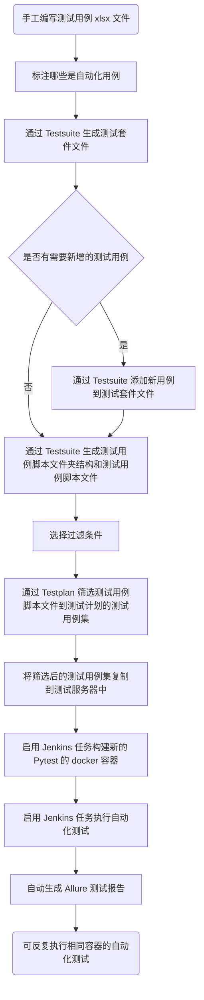

# 概述

AutoTester 是用于生成和管理自动化测试 pytest 脚本的工具软件。

以其为基础与 Jenkins、Docker、Pytest、Allure 、Selenium 等共同构成自动化测试框架。

主要特点是使用流行技术，非封装形式，直接运用常规 Python 库的接口进行自动化测试脚本的生成、管理和执行。

可进行小型或单流程的自动化测试，也可进行复杂的多流程自动化测试。

有利于自动化测试的落地，也有利于团队成员的自我成长和技术栈通用。

# 部件

AutoTester 主要由 Testcase、Testsuite、Testplan 三个部件组成，分别对测试用例、测试套件、测试计划这三个维度进行生成和管理。

- Testcase：主要用于管理测试用例的要素
  - 包括用例编号、用例标题、功能模块、优先级、前置条件、步骤描述、预期结果、备注、标签等
  - 可生成测试用例注释内容的字符串
  - 并不直接使用，通过 Testsuite 调用
- Testsuite：主要用于管理测试套件的要素
  - 包括套件名称、路径、测试用例集
  - 可将手工编写的测试用例 xlsx 文件转换为测试套件文件
  - 可将手工编写的测试用例 xlsx 文件的新增用例添加到测试套件文件中
  - 可由测试套件文件生成测试用例脚本文件夹结构和测试用例脚本文件
- Testplan：主要用于管理测试计划的要素
  - 包括需进行测试计划的测试套件、测试用例过滤器、计划包含的库
  - 可将测试套件中的测试用例经过功能模块、标签、优先级进行过滤选择，生成测试计划，即将要用于测试执行的测试用例集

# 流程

# 结构

测试库的结构如下：

- library：测试用例脚本用到的自编写库文件
  - common：公共库，各种测试均可用到
  - xxx_lib：各个用途的专门库，如各种通信方式的客户端等
- public_method：单独用例集中用到的公共类和公共方法
- public_var：单独用例集中用到的公共变量和枚举值
- testlog：测试过程中的日志
- testplan：生成的测试计划文件夹的归集
  - 测试计划文件夹在生成时可命名
  - 包含library、public_method、public_var、testcase、testlog
- testsuite：测试套件的测试用例脚本文件集，生成时可命名

